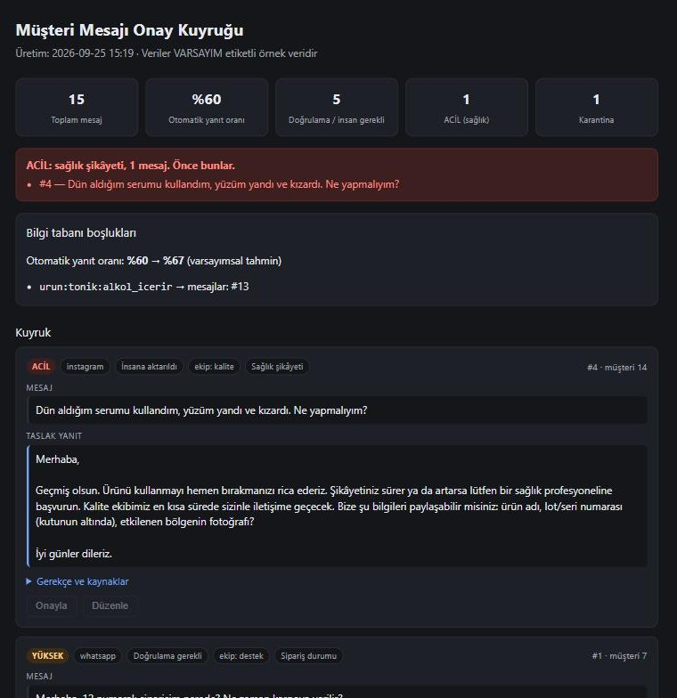

# Müşteri Mesajı Triage Asistanı

Nurederm / LabelSkin uygulama görevi.

**Kısaca**
- WhatsApp ve Instagram mesajlarını okur. Her mesaj için **öncelik, aksiyon, ilgili ekip ve yanıt taslağı** üretir.
- **Bilgi uydurmaz:** sipariş durumu, fiyat, içerik ve politika yalnız veriden gelir. Veride yoksa mesaj insana gider.
- **Riskliyi insana verir:** sağlık şikâyeti ACİL olarak kalite ekibine gider. Başkasının siparişi hakkında bilgi verilmez.
- Sonuçlar tek sayfalık bir **onay kuyruğu panelinde** toplanır (`out/panel.html`, aşağıdaki görüntü).
- Tek komutla çalışır (`python run.py`), ek paket gerekmez. Yapay zekâ (LLM) modu opsiyoneldir.



## Görevi nasıl tanımladım

Elimdeki girdi `mesajlar.json`'daki 15 müşteri mesajıydı; ayrıntılı bir görev tanımı (`case-brief.md`) eklerde
yoktu. Görevi bu mesajlardan çıkararak tanımladım: mesajlar bir destek kutusunu ve içindeki tipik tuzakları
anlatıyor. Sipariş, ürün ve politika verisi verilmediği için bunları **kurgusal örnek veri** olarak ben oluşturdum;
her dosyanın başında `_uyari` alanı var. Gerçek veri ya da farklı bir görev tanımı gelirse değişen yalnız `data/` ve
kural listeleri olur, mimari aynı kalır.

## Hızlı başlangıç

```bash
python run.py              # 15 mesajı işler, out/ klasörüne sonuçları yazar
python eval.py             # sonuçları beklenen davranışla karşılaştırır
pip install -r requirements-dev.txt && python -m pytest -q
```

Python 3.10+ yeterli, çalıştırmak için ek paket gerekmez (yalnız standart kütüphane). Python 3.14 ile test edildi.
Çıktılar repoda da duruyor, çalıştırmadan bakılabilir:

- `out/panel.html`: onay kuyruğu paneli (tarayıcıda açın)
- `out/rapor.md`: aynı kuyruğun metin hali
- `out/results.json`: her mesaj için makine okunur sonuç

### 15 mesajın sonucu

| Aksiyon | Adet | Mesajlar |
|---|---|---|
| Otomatik yanıt | 9 | #2, 6, 8, 9, 10, 11, 12, 14, 15 |
| Doğrulama gerekli | 2 | #1 (başkasının siparişi), #3 (olmayan sipariş) |
| İnsana aktarıldı | 3 | #4 sağlık (ACİL, kalite), #5 iade, #13 bilinmeyen içerik |
| Karantina | 1 | #7 spam |

Örnek taslak (#2):

> Merhaba,
>
> 5 numaralı siparişiniz kargoda. Kargo firması: Yurtiçi Kargo. Takip numarası: YK3000000005. Kargoya veriliş
> tarihi: 24.09.2026. Tahmini varış tarihi: 26.09.2026.
>
> İyi günler dileriz.

Her sonuçta **gerekçe** (hangi kural neden tetiklendi) ve **kaynak** (`siparisler.json#5` gibi) tutulur. Bir
temsilci taslağı onaylamadan önce neden bu kararın verildiğini görebilir.

## Nasıl çalışıyor

```
mesaj → dil → niyetler (birden fazla olabilir) → sipariş no / ürün / link
      → bilgi tabanına bakış → karar (aksiyon + öncelik + ekip) → yanıt taslağı
```

Tek temel kural: **olgu yalnız veriden gelir.** Sipariş durumu, takip numarası, fiyat, içerik, indirim kodu ve politika
metni `data/` klasöründen okunur. Sınıflandırma katmanı (kural ya da LLM) yalnız mesajı anlar, hiçbir bilgiyi kendisi
üretmez. Veride olmayan bir şey sorulursa taslak "ekibimizden teyit edip döneceğiz" der ve mesaj insana gider.

**Veride yok, olumsuz demek değildir.** Tonikte alkol olup olmadığı bilinmiyorsa (`null`) sistem "alkol yok" demez.
Yalnız açıkça yazılmış değer (`false`, boş liste) olumsuz cevap üretir.

### Aksiyonlar

| Aksiyon | Anlamı |
|---|---|
| `auto_reply` | Taslak veriyle tam cevaplanabiliyor, onaylanıp gönderilebilir |
| `needs_verification` | Müşteriden bilgi gerekiyor (sipariş no, sipariş sahipliği) |
| `human_escalation` | İnsan temsilci devralmalı (sağlık, iade, bilinmeyen bilgi) |
| `quarantine` | Spam, yanıt verilmez |

Bir mesajda birden fazla niyet varsa en sert aksiyon ve en yüksek öncelik geçerli olur.

### Öncelikler

| Öncelik (kod) | Ne zaman |
|---|---|
| **ACİL** (P0) | Sağlık şikâyeti. Hiçbir koşulda otomatik cevaplanmaz, spam işareti taşısa bile insan kuyruğundan düşmez |
| YÜKSEK (P1) | İade/hasar, bulunamayan ya da başkasına ait sipariş |
| NORMAL (P2) | Olağan sipariş sorusu |
| DÜŞÜK (P3) | Bilgi soruları, spam |

## Veride fark ettiğim tuzaklar

| # | Mesaj | Ne yapıyor |
|---|---|---|
| 1 | 7 numaralı müşteri, 12 numaralı siparişi soruyor | 12 başka müşteriye ait. Sipariş bilgisi paylaşılmaz, sahiplik doğrulaması istenir |
| 3 | 9999 numaralı sipariş | Kayıt yok. Durum uydurulmaz, sipariş no teyidi istenir |
| 4 | Serumdan sonra yanma ve kızarıklık | ACİL, kalite ekibine gider. Tıbbi tavsiye yok; kullanımı bırakması, gerekirse sağlık profesyoneline başvurması söylenir, ürün adı + lot no + fotoğraf istenir |
| 6 | İngilizce mesaj | Yanıt İngilizce |
| 7 | Takipçi satışı + kısa link | Karantina, yanıt yok, link açılmaz |
| 8 | Hem fiyat hem sipariş | İki soru da tek taslakta cevaplanır |
| 13 | "Tonik 200 ml mi, alkol var mı?" | 200 ml cevaplanır, alkol bilgisi veride yok, ürün ekibine gider. "200" sipariş numarası sanılmaz |
| 14 | İndirim kodu | Kod uydurulmaz. Veride aktif kod yok, bu açıkça söylenir |

Sipariş sahipliği mesajdaki **her** sipariş numarası için ayrı kontrol edilir: aynı mesajda hem kendi hem başkasının
siparişi varsa yalnız kendisininki cevaplanır.

#1 ile #3 bilerek **aynı** yanıtı alır. "Böyle bir sipariş yok" ile "bu sipariş size ait değil" ayrı cevaplar olsaydı,
biri numaraları deneyerek hangi siparişlerin var olduğunu öğrenebilirdi. Ayrım yalnız iç gerekçede tutulur.

## Ekstralar

### Onay kuyruğu paneli (`out/panel.html`)

Destek sorumlusunun sabah açacağı tek sayfa: özet kartları (otomatik yanıt oranı, insan gereken mesaj, acil sayısı),
kırmızı ACİL bandı (sağlık şikâyetleri listenin en başında ayrıca gösterilir), önceliğe göre sıralı mesajlar, her birinde taslak, gerekçe ve kaynak. Tek HTML dosyası; JavaScript
ya da dış bağımlılık yok. Müşteri metni sayfaya kaçışlanarak yazılır (HTML enjeksiyonu testi var).

### Bilgi tabanı boşluk raporu

Hangi eksik verinin otomasyonu engellediğini gösterir. Bugünkü örnek veride tek boşluk tonikte alkol bilgisi.
Eksik alanlar doldurulmuş gibi yapılıp mesajlar **aynı karar fonksiyonundan** yeniden geçirilir; yalnız sonucu
gerçekten otomatiğe dönen mesajlar sayılır (sahiplik ya da sağlık gibi başka engeli olanlar sayılmaz):

**Otomatik yanıt oranı %60 → %67 (varsayımsal tahmin).**

Kozmetik tarafında asıl mesaj şu: otomasyonun darboğazı çoğu zaman yapay zekâ değil, ürün içerik verisinin (INCI,
alkol, parfüm, uygun cilt tipi) eksiksiz ve erişilebilir olmasıdır.

### Kozmetik yan etki bildirimi

#4 gibi mesajlarda taslak ürün adı, lot/seri numarası ve fotoğraf ister, mesaj kalite ekibine gider. Kozmetikte
istenmeyen etkilerin kayıt altına alınması düzenleyici bir yükümlülük; gerçek sistemde bu adım şirketin kalite
prosedürüne bağlanmalı. Buradaki metinler örnek.

### Görülmemiş mesajlarla ölçüm

Kuralları 15 mesaja bakarak yazdım, dolayısıyla 15/15 genelleme kanıtı sayılmaz. Bunu ölçmek için kodu hiç görmemiş
ayrı bir yapay zekâ ajanına 20 yeni, gerçekçi mesaj yazdırıp beklenen davranışla etiketlettim (`tests/varyasyonlar.json`:
Türkçe karakter kullanmayan yazım, emoji, İngilizce, farklı ifadeler, linksiz spam, katalogda olmayan ürün).

| Ölçüm | Tamamen doğru |
|---|---|
| İlk ölçüm, kurallar bu mesajları hiç görmeden (`docs/varyasyon_ilk_olcum.md`) | **10/20** |
| Düzeltmelerden ve iki bağımsız incelemeden sonra (`python eval_varyasyon.py`) | 20/20 |

İkinci sayı artık görülmüş veri üzerinde, genelleme iddiası değil. Asıl bilgi ilk ölçümde. Bu 20 mesajda hiçbir mesaj
haksız yere otomatik cevaplanmadı. Ama biri eksik yönlendirildi: cildi soyulan bir müşteri ACİL yerine DÜŞÜK öncelik
aldı (yine insana gidiyordu, ama acil işaretlenmiyordu). Bir de iki İngilizce mesaja Türkçe cevap üretildi. İki koruma
artık test: ACİL beklenen mesaj ACİL'den düşmez, beklenmeyen mesaj otomatik cevaplanmaz (`tests/test_varyasyon.py`).
Bu bekçilerin gerçekten kırmızı verebildiği de test ediliyor: sağlık kontrolü kapatılınca ya da her mesaj otomatiğe
zorlanınca testler düşüyor.

Bir etiket sonradan değişti: #118 hem hayvan testini hem "vegan" olup olmadığını soruyor. Veride vegan bilgisi yok, bu
yüzden doğru davranış insana aktarmak. İlk etiket "otomatik yanıt" diyordu; gerekçesi dosyada `etiket_notu` alanında.

**Bu ölçüm "sistem her mesajda güvenli davranır" demek değil.** Üç bağımsız incelemede (aşağıda) uydurulmuş basit
mesajlarla açıklar bulundu ve kapatıldı. Kural tabanlı bir sistemde yeni ifadeler her zaman yeni açık demektir. Bu
yüzden gerçek kullanımda başlangıçta her taslak insan onayından geçmeli.

## LLM modu (opsiyonel)

```bash
pip install anthropic
export ANTHROPIC_API_KEY=...        # yoksa sistem uyarıp kural tabanlı modda çalışır
python run.py --llm                 # model: LLM_MODEL ortam değişkeni, varsayılan claude-opus-5
```

LLM yalnız **anlamayı** yapar: dil, niyetler, ürün. Sipariş, fiyat ya da politika verisini hiç görmez ve yanıt
yazmaz; yanıtlar her iki modda da aynı şablonlardan ve aynı veriden kurulur. Çıktı JSON şemasıyla sınırlanır ve
doğrulanır. Geçersiz ya da boş cevap, model reddi ya da herhangi bir hata olursa o mesaj kural tabanlı sınıflandırmaya
düşer ve bu gerekçeye yazılır.

İki şey her modda deterministik kalır: **sağlık kontrolü** ve **sipariş numarası çıkarımı.** LLM bir sağlık şikâyetini
"spam" diye etiketlese bile sağlık kuralı onu ACİL olarak insana gönderir (testli).

**Sınır:** bu makinede API anahtarı olmadığı için LLM yolu gerçek API'ye karşı koşturulmadı. Sahte bir istemciyle
testli (istek şekli, şema, reddetme ve hata durumları, güvenlik katmanı), ama canlı model çıktısı repoda yok.

## Varsayımlar

- Ayrıntılı görev tanımı eklerde yoktu; görev mesajlardan çıkarıldı.
- `data/siparisler.json`, `urunler.json`, `politikalar.json` kurgusal. Sipariş 12'nin başka müşteriye ait olması,
  9999'un olmaması ve tonikte alkol bilgisinin `null` olması **bilerek** tasarlandı, tuzakları sınamak için.
- Sipariş sahipliği `musteri_id` eşleşmesiyle kontrol ediliyor. Gerçekte WhatsApp/Instagram kimliğinin müşteri
  kaydına nasıl bağlandığı ayrı bir doğrulama konusu.
- Politika metinleri (hayvan testi dahil) örnektir, şirketin beyanı değildir. Gerçek sistemde yalnız onaylı metin kullanılır.
- `tests/varyasyonlar.json`'daki etiketler ayrı bir ajanın yargısı; biri (#118) gerekçesiyle değiştirildi.

## Üretime geçerken

- **Veri:** JSON dosyaları yerine sipariş API'si/ERP ve ürün kataloğu. `knowledge.py` tek erişim noktası olduğu için
  değişiklik oraya sınırlı kalır.
- **Kanal:** WhatsApp Business API ve Instagram webhook'ları; müşteri kimliğini siparişle eşleştiren doğrulama adımı.
- **Onay akışı:** paneldeki "Onayla / Düzenle" düğmeleri gerçek gönderime bağlanır. Başlangıçta her taslak insan
  onayından geçer; otomatik gönderim, ölçülen doğruluğa göre niyet niyet açılır.
- **Metinler:** şablonlar marka ekibinin onayladığı metinlerle değiştirilir.
- **İzleme:** otomatik yanıt oranı, insana aktarma nedeni, yanıt süresi, temsilcinin taslağı ne sıklıkla düzelttiği.

## Bitmeyenler ve bilinen sınırlar

- LLM modu canlı API'ye karşı denenmedi (anahtar yok).
- Kural tabanlı sınıflandırma yeni ifadelerde kırılgan (ilk ölçüm 10/20). Gerçek trafikte yeni ifadeler yeni açık
  demektir. LLM modu ya da gerçek mesajlardan kural ve örnek zenginleştirmesi gerekir.
- Sağlık kelimeleri bilerek geniş tutuldu: "sivilce", "alerji", "yan etki var mı?" gibi yalnız soru soran mesajlar da
  ACİL işaretlenir ve taslak kullanımı bırakmayı önerir. Bu yanlış alarmı, gerçek bir reaksiyonu kaçırmaya tercih ettim.
- Sistem yalnız tanıdığı soruları işaretleyebilir. Bir mesajda tanıdığı bir soruyla birlikte tanımadığı ikinci bir
  soru varsa ("hangi cilt tipine uygun, gündüz kullanılır mı?"), ikincisi sessizce atlanabilir. Bu yüzden
  otomatik yanıtlar da başlangıçta insan onayından geçmeli.
- Konuşma geçmişi yok: her mesaj tek başına değerlendiriliyor. "Tamam, sipariş numaram 45" gibi devam mesajları
  önceki bağlamı bilmiyor.
- Müşteri kimliği `musteri_id` olarak hazır kabul ediliyor.
- Kargo ücreti, vegan/helal durumu ve hamilelikte kullanım gibi bilgiler veride yok; bunlar insana gidiyor.
- Panel statik bir rapor; onay düğmeleri bir şeye bağlı değil.

## Yapay zekâ kullanımı

Görev yapay zekâ aracı kullanılarak yapılacak şekilde tasarlanmıştı; ben Claude Code kullandım. Veriyi okuyup
tuzakları çıkardım, mimariyi ve karar kurallarını belirledim. Planı iki ayrı modele (Claude ve Codex) gözden
geçirttim; Codex'in itirazları plana girdi (bilinmeyen ile olumsuzun ayrılması, sipariş başına yetki kontrolü,
sağlık+spam çakışması, HTML kaçışı). Kodun parçalarını alt ajanlara yazdırdım, çıktıları testle ve taslakları tek
tek okuyarak doğruladım. Varyasyon seti kuralları görmemiş ayrı bir ajan tarafından yazıldı.

Bitmiş kodu üç bağımsız incelemeye verdim: taze bir Claude ajanı, Codex ve son olarak Claude Fable. Hepsi
uydurulmuş mesajlarla açık aradı. İlk ikisi gerçek açıklar buldu. Örneğin sahibi olunan bir sipariş için gelen
"iptal etmek istiyorum" mesajı durum cevabıyla otomatik yanıtlanıyordu, "Şişli" kelimesi sağlık alarmı veriyordu,
"Retinol hamilelikte uygun mu?" sorusuna cilt tipi cevabı dönüyordu. Son incelemede 45 yeni mesajla engelleyici bir
bulgu çıkmadı. Beş küçük düzeltme yapıldı; örneğin "siparişim geldi mi?" durum sorusu olarak tanınmıyordu. Bulunan
her açık kapatıldı ve her biri için regresyon testi eklendi.

## Dosya haritası

```
run.py               tek komut: mesajları işler, out/ klasörüne yazar
eval.py              sonuçları tests/golden.json ile karşılaştırır
eval_varyasyon.py    20 mesajlık varyasyon setiyle ölçüm
triage/
  models.py          veri tipleri (niyet, aksiyon, öncelik, sonuç)
  text.py            Türkçe normalizasyon (İ/ı, ş, ğ...)
  knowledge.py       tek olgu kaynağı: sipariş, ürün, politika
  classify.py        kural tabanlı anlama: dil, niyet, sipariş no, ürün, link, sağlık katmanı
  llm.py             opsiyonel LLM ile anlama (aynı arayüz)
  decide.py          aksiyon, öncelik, ekip; sipariş sahipliği
  reply.py           yanıt taslağı (TR/EN), yalnız veriden
  pipeline.py        hepsini bağlar; güvenlik katmanını her modda uygular
  render.py          onay kuyruğu (rapor.md, panel.html) ve bilgi boşluğu raporu
data/                mesajlar.json (verilen) + örnek sipariş/ürün/politika verisi
tests/               181 test (88 test fonksiyonu, bir kısmı parametreli); golden.json, varyasyonlar.json
out/                 üretilmiş çıktılar
docs/                varyasyon setinin ilk ölçümü, panel görüntüsü
```
